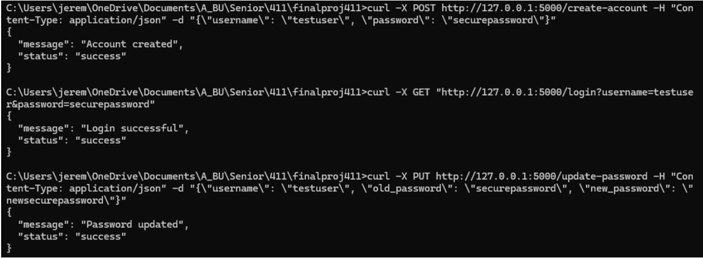

# CS411 Final Group Project 
## Weather Dashboard Application
### Overview
* The Weather Dashboard is a web-based application designed to provide users with easy access to weather information.
* This application allows users to set favorite locations and quickly view current and forecasted weather and air pollution data for these locations.
* By offering userspecific customization, the Weather Dashboard aims to deliver a personalized weather tracking experience, making it easier for users to get the most relevant weather information based on their interests and needs.
* Database: MySQL

### Contributors
* Andrew Xin
* Jeremy Lau
* Sarah Lam
* Tong Zhang

## APi Call Route
### Route1: openweather_api/get-coords
* **Request Type:** GET
* **Purpose:** Fetches the coordinates (latitude, longitude) of a city.
* **Request Parameters:**
  * city (str): The name of the city.
  * country_code (str, optional): The country code. Defaults to None.
* **Response Format:** JSON
  * Success Response Example:
    * Code: 200
    * Content: ``` { "message": "Found coordinates: {data[0]['lat']}, {data[0]['lon']}"} ```
* **Example Request:**
  ```
    {
      "city": "San Francisco"
    }
  ```
* **Example Response:**
  ```
    {
      "message": "Found coordinates: 37.7790262, -122.419906",
      "status": "200"
    }
  ```

### Route2: openweather_api/get-forecast
* **Request Type:** GET
* **Purpose:** Fetches weather forecast.
* **Request Parameters:**
  * lat (float): Latitude of the location.
  * lon (float): Longitude of the location.
  * units (str): Units of measurement (standard, metric, imperial). Defaults to "imperial".

* **Response Format:** JSON
  * Success Response Example:
    * Code: 200
    * Content: ``` { "message": "Forecast data retrieved for lat={lat}, lon={lon}"} ```
* **Example Request:**
  ```
    {
      "lat": 37.7790262
      "lon": -122.419906
    }
  ```
* **Example Response:**
  ```
    {
      "list": [
        {
          "dt": 1733864400,
          "main": {
            "temp": 285.88,
            "feels_like": 284.75,
            "temp_min": 285.88,
            "temp_max": 285.98,
            "pressure": 1028,
            "sea_level": 1028,
            "grnd_level": 1023,
            "humidity": 59,
            "temp_kf": -0.1
          },
          "weather": [
            {
              "id": 803,
              "main": "Clouds",
              "description": "broken clouds",
              "icon": "04d"
            }
          ],
          "clouds": {
            "all": 74
          },
          "wind": {
            "speed": 3.54,
            "deg": 33,
            "gust": 4.25
          },
          "visibility": 10000,
          "pop": 0,
          "sys": {
            "pod": "d"
          },
          "dt_txt": "2024-12-10 21:00:00"
        },
        // ... Additional forecast entries ...
     ],
     "cod": "200",
     "message": "Forecast data retrieved for lat=37.7790262, lon=-122.419906",
     "cnt": 40,
     "city": {
     "id": 5391959,
     "name": "San Francisco",
     "coord": {
       "lat": 37.779,
       "lon": -122.4199
      },
     "country": "US",
     "population": 805235,
     "timezone": -28800,
     "sunrise": 1733843690,
     "sunset": 1733878258
      }
    }
  ```

### Route3: openweather_api/get-air-pollution-forecast
* **Request Type:** GET
* **Purpose:** Fetches air pollution forecast data for a location.
* **Request Parameters:**
  * lat (float): Latitude of the location.
  * lon (float): Longitude of the location.
* **Response Format:** JSON
  * Success Response Example:
    * Code: 200
    * Content: ``` { "message": "Air pollution forecast data retrieved for lat={lat}, lon={lon}"} ```
* **Example Request:**
  ```
    {
      "lat": 37.7790262
      "lon": -122.419906
    }
  ```
* **Example Response:**
  ```
    {
    "coord": {
      "lon": -122.4159,
      "lat": 37.7797
     },
     "list": [
       {
         "main": {
           "aqi": 3
         },
         "components": {
           "co": 460.63,
           "no": 8.16,
           "no2": 40.1,
           "o3": 45.78,
           "so2": 13.35,
           "pm2_5": 28.91,
           "pm10": 37.81,
           "nh3": 1.24
         },
         "dt": 1733868802
       }
     ]
   }
  ```

### Route4: openweather_api/get-current-weather
* **Request Type:** GET
* **Purpose:** Fetches current weather. for a location.
* **Request Parameters:**
  * lat (float): Latitude of the location.
  * lon (float): Longitude of the location.
  * units (str): Units of measurement (standard, metric, imperial). Defaults to "imperial".
* **Response Format:** JSON
  * Success Response Example:
    * Code: 200
    * Content: ``` { "message": "Current weather data retrieved for lat={lat}, lon={lon}"} ```
* **Example Request:**
  ```
    {
      "lat": 37.7790262
      "lon": -122.419906
    }
  ```
* **Example Response:**
  ```
    {
     "coord": {
       "lon": -122.4199,
       "lat": 37.779
     },
     "weather": [
       {
         "id": 803,
         "main": "Clouds",
         "description": "broken clouds",
         "icon": "04d"
       }
     ],
     "base": "stations",
     "main": {
       "temp": 287.14,
       "feels_like": 286.21,
       "temp_min": 285.34,
       "temp_max": 289,
       "pressure": 1026,
       "humidity": 62,
       "sea_level": 1026,
       "grnd_level": 1022
     },
     "visibility": 10000,
     "wind": {
       "speed": 4.02,
       "deg": 0,
       "gust": 8.05
     },
     "clouds": {
       "all": 75
     },
     "dt": 1733869553,
     "sys": {
       "type": 2,
       "id": 2017837,
       "country": "US",
       "sunrise": 1733843690,
       "sunset": 1733878258
     },
     "timezone": -28800,
     "id": 5391959,
     "name": "San Francisco",
     "cod": 200
   }
  ```
  
### Route5: openweather_api/get-air-pollution
* **Request Type:** GET
* **Purpose:** Fetches current air pollution data for a location.
* **Request Body:**
  * lat (float): Latitude of the location.
  * lon (float): Longitude of the location.
* **Response Format:** JSON
  * Success Response Example:
    * Code: 200
    * Content: ``` { "message": "Air pollution forecast data retrieved for lat={lat}, lon={lon}"} ```
* **Example Request:**
  ```
    {
      "lat": 37.7790262
      "lon": -122.419906
    }
  ```
* **Example Response:**
  ```
   {
     "coord": {
       "lon": -122.4207,
       "lat": 37.7765
     },
     "list": [
       {
         "main": {
           "aqi": 3
         },
         "components": {
           "co": 460.63,
           "no": 8.16,
           "no2": 40.1,
           "o3": 45.78,
           "so2": 13.35,
           "pm2_5": 28.91,
           "pm10": 37.81,
           "nh3": 1.24
         },
         "dt": 1733868357
       }
     ]
   }
  ```


## Favorite Management

### Route1: models/FavoriteModel/add-favorite
* **Request Type:** POST
* **Purpose:** Add a favorite location for a user.
* **Request Body:**
  * user_id (int): The ID of the user.
  * location (str): The location to be added as a favorite.

* **Response Format:** JSON
  * Success Response Example:
    * Code: 200
    * Content: ``` { "message": "User {user_id} added new favorite location: {location}"} ```
* **Example Request:**
  ```
    {
      "user_id": 1
      "location": "San Francisco"
    }
  ```
* **Example Response:**
  ```
    {
      "message": "User 1 added new favorite location: San Francisco",
      "status": "200"
    }
  ```

### Route2: models/FavoriteModel/update-favorite
* **Request Type:** PUT
* **Purpose:** Update a user's favorite location.
* **Request Body:**
  * user_id (int): The ID of the user.
  * old_location (str): The location to be replaced.
  * new_location (str): The new location to replace the old one.
* **Response Format:** JSON
  * Success Response Example:
    * Code: 200
    * Content: ``` { "message": "User {user_id} updated favorite location '{old_location}' to '{new_location}'"} ```
* **Example Request:**
  ```
    {
      "user_id": 1
      "old_location": "San Francisco"
      "new_location": "San Jose"
    }
  ```
* **Example Response:**
  ```
    {
      "message": "User 1 updated favorite location San Francisco to San Jose",
      "status": "200"
    }
  ```

### Route3: models/FavoriteModel/remove-favorite
* **Request Type:** DELETE
* **Purpose:** Remove a favorite location for a user.
* **Request Body:**
  * user_id (int): The ID of the user.
  * location (str): The location to be added as a favorite.
* **Response Format:** JSON
  * Success Response Example:
    * Code: 200
    * Content: ``` { "message": "User {user_id} removed new favorite location: {location}"} ```
* **Example Request:**
  ```
    {
      "user_id": 1
      "location": "San Francisco"
    }
  ```

* **Example Response:**
  ```
    {
      "message": "User 1 removed new favorite location: San Francisco",
      "status": "200"
    }
  ```


### Route4: models/FavoriteModel/clear-favorites
* **Request Type:** DELETE
* **Purpose:** Clear all favorite locations for a user.
* **Request Body:**
  * user_id (int): The ID of the user.
* **Response Format:**
  * Success Response Example:
    * Code: 200
    * Content: { "message": "User {user_id} cleared all favorite locations."}
* **Example Request:**
  ```
    {
      "user_id": 1
    }
  ```
* **Example Response:**
  ```
    {
      "message": "User 1 cleared all favorite locations.",
      "status": "200"
    }
  ```

### Route5: models/FavoriteModel/get-favorites
* **Request Type:** GET
* **Purpose:** Get all favorite locations for a user.
* **Request Parameters:**
  * user_id (int): The ID of the user.
* **Response Format:**
  * Success Response Example:
    * Code: 200
    * Content: { "message": "Fetched {len(favorites)} favorite(s) for user {user_id}."}
* **Example Request:**
  ```
    {
      "user_id": 1
    }
  ```
* **Example Response:**
  ```
    {
      "favorites": [
        {
          "location": "New York",
        },
        {
          "location": "San Francisco",
        }
      ],
      "status": "200"
    }
  ```
  
## User Management

